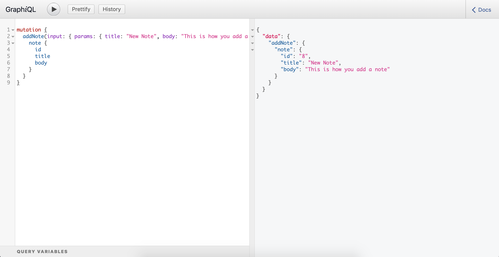
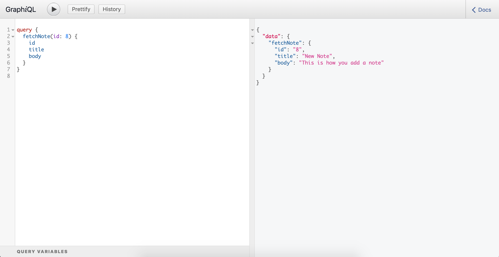
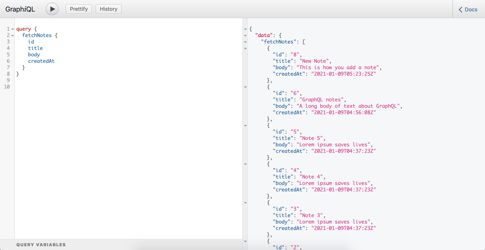
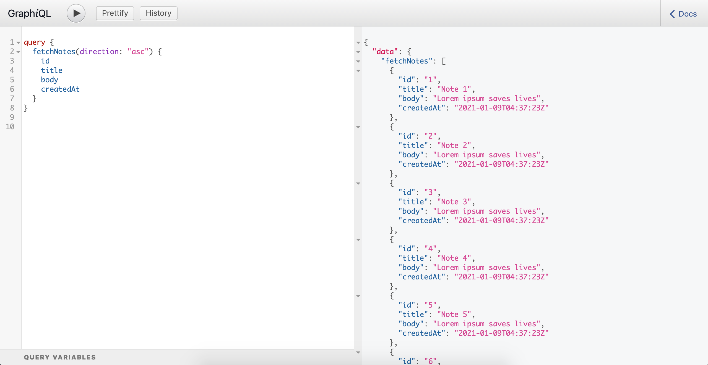

# README

This is a very basic rails app to allow me to experiment with writing a GraphQL api. This app allows you to create and retrieve notes that consist of a title and body.

Using GraphiQL you are able to add notes to the database, retrieve a note by it's id, and retrieve all notes (you can pass an optional `direction` argument to control how the notes are sorted)

Add Note:

Fetch Note:

Fetch Notes:

Fetch Notes (Ascending):
